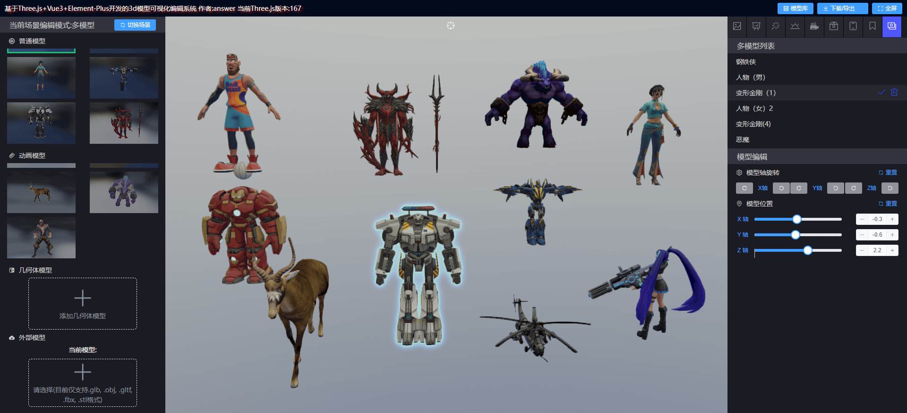
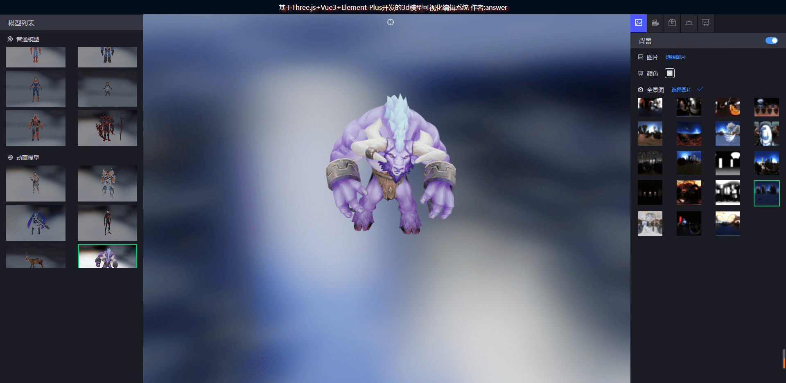
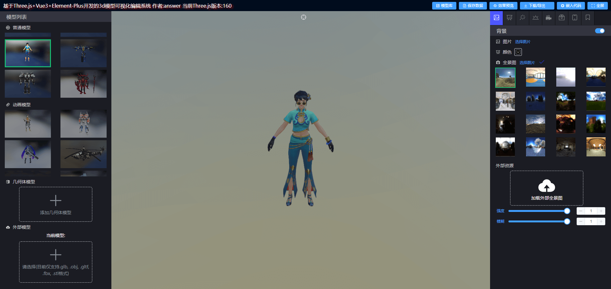
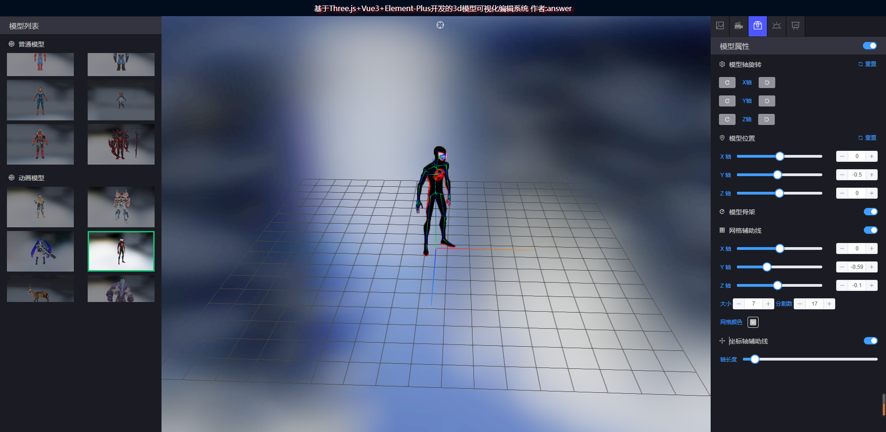
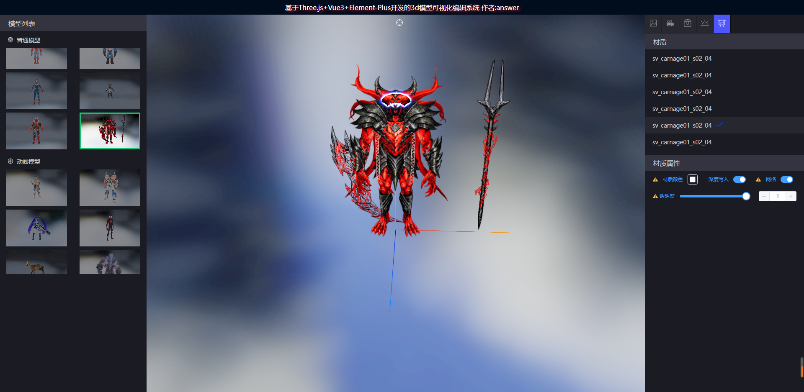
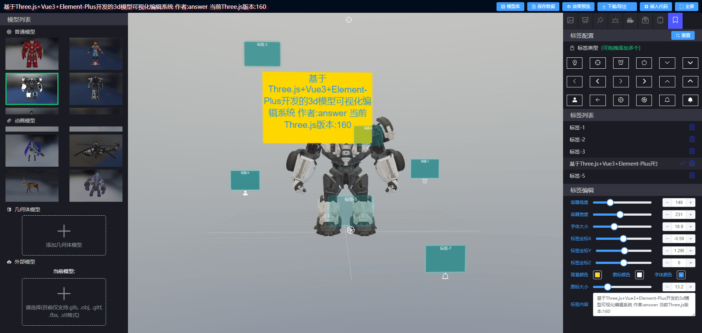
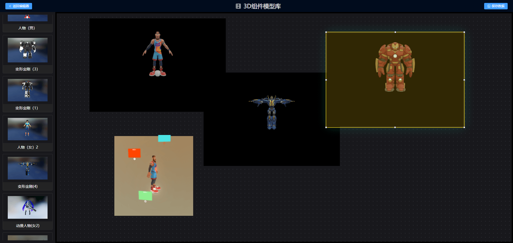

### 🌱 基于 Three.js+Vue3+Typescript+Element-Plus 开发的 3d 模型可视化编辑系统

<a href='https://gitee.com/ZHANG_6666/Three.js3D/stargazers'></img></a> <a href='https://gitee.com/ZHANG_6666/Three.js3D/members'></img></a>

<a target="_black" href="https://github.com/zhangbo126/threejs-3dmodel-edit">

</a>
<a target="_black" href="https://github.com/zhangbo126/threejs-3dmodel-edit">

</a>

### 📦️ 分支介绍

1. master: `Vue3+Pinia+Javascript` (最新的功能 issues 和修复的 bug 都在这个分支)
2. ts-master: `Vue3+Pinia+Typescript` (master 分支的 typescript 版本,最新版本的ts代码正在开发中ing...)
3. develop: `Vue3+Pinia+Javascript` (一些不确定的功能和代码重构会在这个分支开发)
4. gh-pages: `git-pages 线上包分支` (忽略即可)

### 🌐 安装/启动/打包(详见 package.json)

```

 yarn  / yarn serve  / yarn build(yarn build:pro)

 pnpm install / pnpm serve / pnpm build(pnpm build:pro)

```

### 🎨 预览

- 1.注意:部分模型文件较大,首次加载需要等待较长时间
- 2.关于打包部署服务端:在 vite.config.js 里修改 base 路径来适配当前的域名路径

### 项目地址

- github:[https://github.com/zhangbo126/threejs-3dmodel-edit](https://github.com/zhangbo126/threejs-3dmodel-edit)
- gitee:[https://gitee.com/ZHANG_6666/Three.js3D](https://gitee.com/ZHANG_6666/Three.js3D)

### 🎵 主要技术栈

| 名称                     | 版本    | 名称         | 版本  |
| ------------------------ | ------- | ------------ | ----- |
| Vue                      | 3.5.13  | Axios        | 1.5.0 |
| Vite                     | 4.3.x   | Element-plus | 2.4.x |
| Three                    | 0.169.x | Pinia        | 2.1.x |
| Vue3-Draggable-Resizable | 1.6.x   | Mitt         | 3.0.x |
| 详见 `package.json`      | 😁      | 🥰           | 🤗    |

### 🌺 开发环境

| 名称 | 版本    | 名称    | 版本   |
| ---- | ------- | ------- | ------ |
| node | 21.3.0  | npm     | 10.2.4 |
| yarn | 1.22.21 | windows | 10     |
| pnpm | 9.15.1  | windows | 10     |

### 🍻 问题/功能

1. 任何问题 bug 和功能需求欢迎提 issues
2. 更多功能持续更新中...
3. 当前项目three.js版本跟随官方版本持续同步，如有版本升级导致bug请提issues

### 🗃️ 功能模块介绍

| 模块名称🚀     | 功能简介         | 功能简介                  | 功能简介                           | 功能简介          |
| -------------- | ---------------- | ------------------------- | ---------------------------------- | ----------------- |
| 背景           | 背景图加载       | 全景图加载                | 外部全景图（hdr,jpeg,png）         | 外部视频（video） |
| 材质           | 材质类型切换     | 材质选中效果              | 材质属性修改（颜色，网格，透明度） | 材质贴图修改      |
| 后期处理       | 模型分解         | 模型材质拖拽，缩放，平移  | 辉光效果（颜色，强度，半径 ）      |                   |
| 模型灯光       | 环境光编辑       | 平行光编辑                | 点光源编辑                         | 聚光灯编辑        |
| 模型动画       | 动画播放         | 动画配置修改              | 动画轴旋转（x,y,z）                |                   |
| 辅助线/轴配置  | 轴旋转（x,y,z）  | 模型位置修改              | 网格辅助线                         | 坐标轴辅助线      |
| 几何体模型配置 | 几何体模型选中   | 几何体模型配置修改        |                                    |                   |
| 3d标签配置     | 标签拖拽加载渲染 | 标签选中                  | 标签内容编辑                       |                   |
| 多模型配置     | 多模型选中效果   | 多模型位置,轴旋转修改     | 多模型大小缩放                     |                   |
| 左侧操作栏     | 编辑模型场景切换 | 几何体模型添加            | 外部模型加载                       | 多模型拖拽        |
| 顶部操作栏     | 模型预览         | 模型导出（.glb,obj,usdz） | 嵌入代码                           | 编辑数据保存      |
| 模型库         | 模型编辑效果展示 | 模型拖拽添加              | three.js3d模型在可视化大屏上展示   |                   |

### 💥 注意

1. 部分功能的使用对电脑的内存依赖较高，如有卡顿等场景请确保有足够的内存使用空间
2. 建议使用谷歌浏览器`（chrome）`
3. 模型数据编辑配置存储在`localStorage`如有数据相关报错清除本地数据缓存重新进入即可
4. 外部模型不支持效果预览，和数据保存
5. 3d 模型对性能依赖较高,模型库组件配置过`(>4)`,可能导致浏览器崩溃
6. 部分特殊模型文件和大模型文件加载可能会导致系统卡顿很长时间,如遇到这种情况`（欢迎提issues）`

### 💚 如果觉得该项目对你有帮助留个 star 也是不错的 ⭐

### 🥰 或者请作者喝杯咖啡吧,这将是我持续更新的动力,相信这肯定比打赏主播更有意义


### 🥰又或者该↓项目能满足你的需求,也可联系咨询作者

<!-- Start of Selection -->

**[3D模型场景编辑器(Vue3/React18)](http://threeflowx.cn/docs/):** [获取授权](http://threeflowx.cn/docs/)

<!-- End of Selection -->

### 👷 界面









## 主要目录结构

### 1. 核心文件

- App.vue : 应用程序的根组件，包含路由视图和消息提示对话框
- main.js : 应用程序入口文件，负责初始化 Vue 应用、注册全局组件、指令和插件

### 2. /assets 目录

存放静态资源文件：

- image/ : 图片资源
- maps/ : 贴图资源
- model-icon/ : 模型图标资源

### 3. /components 目录

包含可复用的组件：

- DraggableResizableItem/ : 可拖拽和调整大小的组件
- ImplantCodeDialog/ : 代码植入对话框组件
- Loading/ : 加载状态组件
- MessageTipDialog/ : 消息提示对话框组件
- ModelChoose/ : 模型选择组件
- ModelEditPanel/ : 模型编辑面板组件
- RightContextMenu/ : 右键上下文菜单组件
- index.js : 组件导出文件

### 4. /config 目录

配置文件：

- constant.js : 常量定义，包含着色器代码等
- model.js : 模型配置，包含模型列表、背景列表和贴图列表

### 5. /layouts 目录

布局组件：

- EditView.vue : 编辑视图布局
- VrView.vue : VR视图布局

### 6. /router 目录

路由配置：

- index.js : 路由定义和配置

### 7. /store 目录

状态管理：

- meshEditStore.js : 模型编辑状态管理
- pinia.js : Pinia 状态管理配置

### 8. /style 目录

样式文件：

- globe.scss : 全局样式
- index.scss : 样式入口文件

### 9. /utils 目录

工具函数和类：

- directive.js : 自定义指令，如加载状态指令
- globalComponent.js : 全局组件注册
- globalProperties.js : 全局属性和方法
- indexedDB.js : IndexedDB 数据库操作
- initThreeTemplate.jsx : Three.js 场景初始化模板
- renderModel.js : 模型渲染工具
- storage.js : 本地存储工具
- utilityFunction.js : 通用工具函数
- vrRenderModel.js : VR 模型渲染工具 /utils/modelEditClass 目录
  模型编辑相关的类和模块：

- index.js : 模块导出文件，整合所有模型编辑功能
- animationModules.js : 动画模块，处理模型动画
- backgroundModules.js : 背景模块，处理场景背景
- geometryModules.js : 几何体模块，处理模型几何形状
- helperModules.js : 辅助工具模块，提供网格、坐标轴等辅助功能
- lightModules.js : 灯光模块，处理场景光照
- manyModelModules.js : 多模型管理模块，处理多个模型的操作
- materialModules.js : 材质模块，处理模型材质
- stageFlowModules.js : 后期效果模块，处理辉光等后期效果
- tagsModules.jsx : 标注模块，处理模型标注

### 10. /views 目录

视图组件：

- modelBase/ : 模型基础视图
- modelEdit/ : 模型编辑视图
- modelIframe/ : 模型 iframe 视图
- modelPreview/ : 模型预览视图
- vrPage/ : VR 页面视图

## 核心功能模块详解

### 1. 渲染模块

- initThreeTemplate.jsx : 提供完整的 Three.js 场景初始化和渲染功能，包括相机、场景、渲染器、控制器、后期处理等
- vrRenderModel.js : 专门用于 VR 场景的渲染，支持摄像头捕获和模型叠加

### 2. 模型编辑模块

- modelEditClass/ : 提供丰富的模型编辑功能
  - lightModules.js : 控制环境光、平行光、点光源和聚光灯
  - animationModules.js : 处理模型动画播放、控制和旋转
  - stageFlowModules.js : 提供辉光效果、模型拆分和材质拖拽功能
  - helperModules.js : 提供模型旋转、位置调整和辅助工具控制
  - manyModelModules.js : 管理多个模型的选择、删除、变换等操作

### 3. 存储模块

- storage.js : 提供 localStorage 和 sessionStorage 的封装
- indexedDB.js : 提供 IndexedDB 数据库操作

### 4. 全局功能

- globalProperties.js : 注册全局事件总线和存储方法
- globalComponent.js : 注册 Element Plus 图标组件
- directive.js : 提供自定义指令，如加载状态指令

## 项目特点

1. 基于 Vue 3 : 使用 Vue 3 的组合式 API 和 Pinia 状态管理
2. Three.js 集成 : 深度集成 Three.js 实现 3D 模型渲染和编辑
3. 模块化设计 : 将功能拆分为多个模块，便于维护和扩展
4. VR 支持 : 支持 VR 模式，可以通过摄像头实现 AR 效果
5. 丰富的编辑功能 : 支持模型材质、光照、动画、后期效果等多方面的编辑

### 🍻 相关链接

###### Three.js:[https://threejs.org/](https://threejs.org/)

###### Element-Plus:[https://element-plus.gitee.io/zh-CN/](https://element-plus.gitee.io/zh-CN/)

###### 模型下载网站 [https://sketchfab.com/feed](https://sketchfab.com/feed)

###### 贴图素材网站 [https://polyhaven.com/](https://polyhaven.com/)

###### 图片格式转换网站 [https://onlineconvertfree.com/zh/convert/hdr/](https://onlineconvertfree.com/zh/convert/hdr/)
