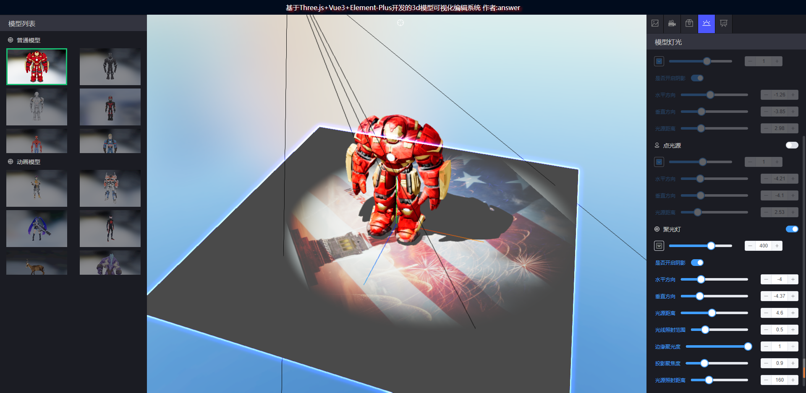

###  🌱基于Three.js+Vue3+Element-Plus开发的3d模型可视化编辑系统

<a href='https://gitee.com/ZHANG_6666/Three.js3D/stargazers'></img></a> <a href='https://gitee.com/ZHANG_6666/Three.js3D/members'></img></a>
### 🎨预览
- 1.注意:部分模型文件较大,首次加载需要等待较长时间
- 2.线上访问:[https://zhang_6666.gitee.io/three.js3d](https://zhang_6666.gitee.io/three.js3d)
###	🍻问题/功能
1. 任何问题bug和功能需求欢迎提issues
2. 更多功能持续更新中...

###	🗃️ 功能简介
- 1.📌背景:背景图,背景颜色,全景图的可视化编辑
- 2.🚀动画:模型自带动画的播放功能,动画播放速度,动作幅度,循环方式的可视化编辑
- 3.🔥属性:模型轴旋转,模型位置,模型骨架,模型坐标轴的可视化编辑
- 4.🎉灯光:环境光,点光源,聚光灯,半球光的可视化编辑
- 5.📦️材质:模型材质贴图修改,材质颜色,透明度,网格的可视化编辑
- 6.✨后期:模型辉光效果,场景色调,模型拆解,模型材质可拖拽的可视化编辑
- 7.⚡️模型导入编辑功能（.glb, .obj, .gltf, .fbx)格式
- 8.⚡️模型编辑效果预览
- 9.🍻支持模型编辑的数据保存，支持多个3d模型组件拖拽配置和编辑效果预览
- 10.🔥 支持模型加载进度条显示,模型封面下载，模型文件导出（.glb,.gltf）
### 🌐 安装/启动
```
 yarn  / yarn serve 
 npm i / npm run serve
 cnpm i / cnpm run serve

```
### 注意
1. node版本>=16.0.0, 
2. 部分功能的使用对电脑的内存依赖较高，如有卡顿等场景请确保有足够的内存使用空间
3. 建议使用谷歌浏览器（chrome）
4. 模型数据编辑配置存储在localStorage如有数据相关报错清除本地数据缓存重新进入即可
5. 外部模型不支持效果预览，和数据保存
6. 3d模型对性能依赖较高,模型库组件配置过(>4),可能导致浏览器崩溃

### 💚如果觉得该项目对你有帮助留个start也是不错的⭐
### 👷 界面





### 🍻 相关链接

###### Three.js:[https://threejs.org/](https://threejs.org/)
###### Element-Plus:[https://element-plus.gitee.io/zh-CN/](https://element-plus.gitee.io/zh-CN/)
###### 模型下载网站 [https://sketchfab.com/feed](https://sketchfab.com/feed)
###### 贴图素材网站 [https://polyhaven.com/](https://polyhaven.com/)
###### 图片格式转换网站 [https://onlineconvertfree.com/zh/convert/hdr/](https://onlineconvertfree.com/zh/convert/hdr/)

